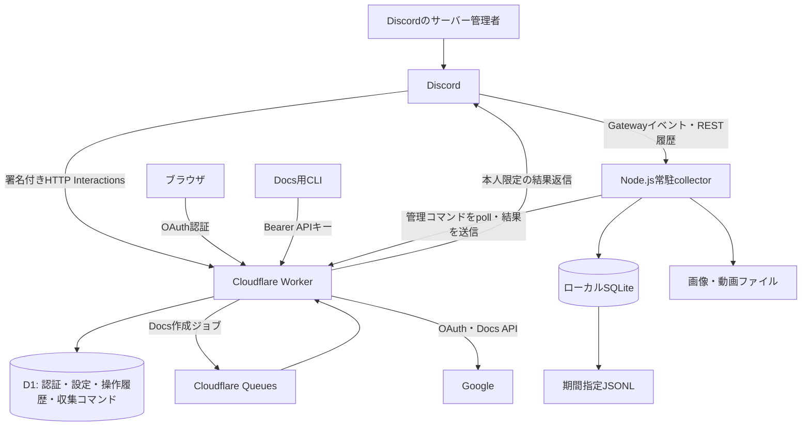
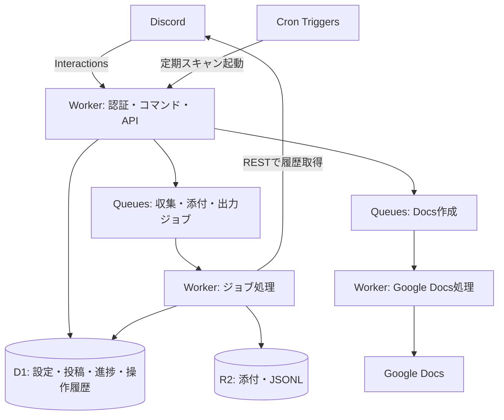

# Telemetry 再現設計・実装計画

## 最初に読む：ユーザー指定の実装方針

- **2026-09-15更新：Discordの `/create` は廃止。** 以下の再現仕様に残る `/create` は旧仕様。再登録・実装しない。Docs API・CLIと `/mtg` による記録作成は継続する。

- **Cloudflare Workers内で動かす構成を設計対象に含める。** 外部PCの常駐collectorを不要にする構成は第19章を参照する。ここでいうWorkers内はWorkersを実行基盤に、D1・R2・QueuesなどCloudflareのマネージドサービスを組み合わせる意味とする。
- 第1〜18章は添付プロジェクトの現行仕様を記録したもの。第19章のWorkers完結案とは、実行場所・保存方法・イベント検知方法を区別する。
- **パッケージ管理・スクリプト実行・開発ツール呼び出しはpnpmに統一する。** `pnpm install`、`pnpm run <script>`、`pnpm exec <tool>`を使い、npm・npx・yarn・bunへ置き換えない。
- Workers完結版では、ローカルNode.jsは開発・テスト・CLIのために使用し、本番の常駐プロセスとして要求しない。

## 変更後の本番反映（ユーザー指定・継続適用）

- **機能・UI・通知文を変更したら、必要な検証後、そのまま本番へデプロイする。** 毎回の確認は求めず、「実装済み・本番未反映」で終えない。ユーザーがデプロイ不要と指定した場合はその指示に従う。
- 必要な追加DBマイグレーションとDiscordコマンド更新も反映する。既存のSecrets・本番固有の変数・データを保持する。
- デプロイ後は公開エンドポイントや関連設定を確認し、結果を報告する。反映できない場合は原因と未完了の作業を明示する。
- 本番確認でテスト投稿・全員メンションを勝手に送らない。権限変更時は新しい招待URLを案内する。

## 利用者向けメッセージの方針（現行実装・優先）

- Discord・Webの利用者向けメッセージは、必要な案内・結果・次の操作だけを簡潔な日本語で伝える。デバッグ用の文言、内部処理の段階、処理件数、内部ID、実装・インフラの説明を通常の通知へ出さない。
- 診断情報は開発者向けログ・CLIへ置く。利用者に対処が必要なエラーは隠さず、短い説明と次の操作を示す。明示的な管理コマンドで操作に必要な予約ID・状態を示すことは許容する。
- `/mtg schedule` は実行したチャンネルへ `@everyone` を付けて「次回MTGの日時を入力してください！」と日程調整ページへのボタンを投稿する。公開案内の成功後は、同じ内容の本人限定返信や長い作成完了メッセージを重ねて出さない。
- **Discord Botの必要な権限・OAuthスコープを変更した場合は、変更した権限と理由をユーザーへ必ず説明し、対象Application IDと必要な権限を含む新しい招待URLを提示する。** 登録スクリプトとREADMEの招待URLも更新する。ユーザーがそのURLで再招待するため、権限変更を黙って済ませない。
- 全員メンションは上記募集案内など、明示的に指定された通知だけで許可する。失敗通知・管理操作の返信ではメンションしない。同じコマンドの再配信で募集案内を重複送信せず、送信結果が不明な場合は自動再送を止める。
- 以下の旧仕様にある「すべて本人限定・メンション無効」やデバッグ用途の記述より、この方針とユーザーの最新指示を優先する。

## 1. この文書の目的

DiscordとGoogle Docsを連携し、Discord投稿をローカルに蓄積できるTelemetryを再現するための設計書。新規プロジェクトのルートに置き、実装担当者・コーディングエージェントの共通仕様として使用する。

- 調査対象：`/Users/toshihiro/Desktop/Telemetry_demo/`
- 確認日：2026-09-15
- 根拠：`src/`、`collector/src/`、マイグレーション、設定サンプル、テスト、README。
- 添付内の既存AGENTS.mdやREADMEは参考資料として扱い、記載されたデプロイや運用作業を今回の依頼として実行していない。
- 以下は添付実装の再現仕様。既存の公開URL、アカウントID、実トークン、稼働環境は引き継がず、再現先で設定する。
- 記載する依存バージョンは添付時点の値であり、最新版の推奨値ではない。

## 2. 何を作るか

以下の3機能を持つシステムを作る。

1. **Docs連携**：Discordサーバーの管理者がGoogle認証し、指定した既存Googleドキュメントに新しいタブを追加する。
2. **投稿収集**：設定したDiscordサーバー・チャンネルの投稿、編集、削除、画像・動画を常駐Botで収集し、ローカルSQLiteへ保存する。
3. **収集管理**：Discordから収集状況を確認し、指定日数の履歴取得を開始する。蓄積データはCLIからJST期間指定のJSONLとして出力する。

### 再現対象外

- 投稿のAI要約、分析、分類。
- 収集JSONLからGoogle Docsへの自動転記。
- ダッシュボード、SPA、独自の投稿閲覧画面。
- Googleドキュメント自体の新規作成、既存タブの編集。
- Markdownの表、画像、太字、リンクなどの完全な書式変換。
- 複数PCによる同一サーバーの分散収集。
- Python版SQLiteの直接移行。

将来、要約・整形処理からDocs作成APIを呼ぶ拡張は可能だが、現行機能の完成とは分けて扱う。

## 3. システム構成



### 責務の境界

| コンポーネント | 担当 |
|---|---|
| Worker | HTTP受付、Discord署名検証、Google OAuth、Docs作成、収集管理コマンドの中継 |
| D1 | サーバー別接続・保存先、OAuth状態、Docs重複実行防止、collectorへのコマンド |
| Queues | Docs作成処理をDiscord初期応答から分離。同じWorkerがProducerとConsumer |
| collector | Discord Gateway接続、REST履歴取得、投稿・添付保存、管理コマンド実行 |
| ローカルSQLite | 投稿、添付メタデータ、収集進捗、削除待ちファイル、コマンド結果 |
| CLI | 認証開始、Docs操作、収集起動・状況確認・JSONL出力 |

Docs連携だけなら常駐Botは不要。投稿収集には常駐プロセスが必要。

## 4. 技術構成

| 項目 | 添付プロジェクトの構成 |
|---|---|
| 言語 | TypeScript、ES Modules |
| Node.js | 24以上。collectorで組み込み`node:sqlite`を使用 |
| パッケージ管理 | pnpm 11系、`packageManager: pnpm@11.23.0` |
| Worker | Cloudflare Workers、Wrangler 4.131.1 |
| Workers互換設定 | `compatibility_date: 2026-09-11`、`nodejs_compat` |
| 永続化 | Cloudflare D1 / Node.js SQLite |
| 非同期処理 | Cloudflare Queues |
| Discord収集 | discord.js 14.27.0 |
| YAML | yaml 2.9.1 |
| 開発・検証 | TypeScript ^5.9.0、tsx ^4.20.0、Node.js test runner |
| Worker統合テスト | Miniflare 5.20260911.0-alpha / workerd |

`pnpm-lock.yaml`を管理し、pnpm workspaceでルートと`collector/`をまとめる。添付と同じ構成を作る場合、preinstallで他のパッケージマネージャーによるインストールを拒否する。

## 5. 操作とユーザー体験

### 5.1 Discordコマンド

すべてサーバー内で利用し、Manage ServerまたはAdministrator権限を確認する。DMを拒否する。応答はEphemeral（本人限定）、メンション通知は無効にする。

| コマンド | 引数 | 動作 |
|---|---|---|
| `/auth` | なし | サーバー専用のGoogle認証リンクをボタンで表示。有効期限10分 |
| `/document` | `document`：任意のURLまたはID | 指定ありで保存先登録、なしで保存先と接続登録状況を表示 |
| `/create` | `document`、`title`、`message`：すべて任意 | 新しいDocsタブを作成し、デバッグ記録を入力 |
| `/telemetry status` | なし | 収集状況・ジョブ・エラーを表示 |
| `/telemetry backfill` | `days`：必須、1〜3650の整数 | 過去指定日数の履歴取得を受付 |

制約：

- `document`のDiscord引数は最大500文字。URLは正規化してIDとして保存する。
- `title`は1〜100 UTF-16コード単位、空白のみ・改行・制御文字を拒否。
- `message`は最大1,000 UTF-16コード単位。
- `/create document:...`は今回の処理だけに適用し、保存先設定を書き換えない。
- 保存先未設定なら`/document`または今回だけのURL指定を案内する。
- Google未接続なら`/auth`を案内する。
- `/document`の「登録済み」はトークンや編集権限が現在も有効であることを保証しない。実際の作成時に確認する。
- backfillの返信は**受付結果**。終了は`status`で確認する。

### 5.2 代表フロー

```text
/auth
→ 本人限定ボタン
→ ブラウザでGoogleへ同意
→ 認証完了ページ
→ /document document:対象URL
→ /create title:デバッグ message:接続テスト
→ 本人限定の処理中表示
→ 作成したタブのURL
```

独自Web画面は認証完了の簡素な日本語HTMLのみ。見出し「Googleドキュメントに接続しました」と、Discordまたはターミナルへ戻る案内を表示する。

### 5.3 CLI

Docs CLI：`auth`、`status`、`run`、`tabs`、`preview`、`logout`を用意する。

```sh
pnpm demo auth
pnpm demo run --doc 'YOUR_DOCUMENT_ID'
pnpm demo tabs --doc 'YOUR_DOCUMENT_ID'
pnpm demo preview
pnpm demo logout
```

共通または実行用オプション：`--title`、`--template`、`--data`、`--request-id`、`--base-url`、`--no-open`。
`run`では未接続時に認証を案内する。`preview`はGoogleへ書き込まない。

collector CLI：

```sh
pnpm collector run
pnpm collector status
pnpm collector export --from 2026-09-14 --to 2026-09-16
pnpm collector retry-attachments
```

`retry-attachments`はBotを停止して実行する。`status`・`export`は稼働中の別ターミナルから使用でき、進行中の添付状態をリセットしない。

## 6. 認証・所有者の設計

### 6.1 サーバー単位の分離

- CLIの所有者は`default`。
- Discordの所有者は`discord:guild:<guildId>`。
- guild IDは署名検証済みInteractionから取得し、引数やOAuth callbackのクエリから任意指定させない。
- 同じサーバー内の管理者はそのサーバーのGoogle接続を共用する。
- 同じユーザーでも、別サーバーの認証・設定・履歴を流用しない。
- 再認証はその所有者の接続だけを置き換える。キャンセルで既存接続を消さない。
- 旧`discord:<userId>`接続は保持しても新しいサーバー処理に流用しない。

### 6.2 Google OAuth

1. ランダムな認証ticket、リクエストID、PKCE verifierを生成する。
2. ticketのハッシュと所有者をD1へ保存し、10分有効の開始URLを返す。
3. 開始URLを一度だけ消費し、stateとブラウザ識別用Cookieを発行する。
4. GoogleへPKCE S256付きでリダイレクトする。
5. callbackでstate、Cookie、期限、未使用状態を原子的に確認する。
6. codeを交換し、Docsスコープとrefresh tokenの存在を確認する。
7. refresh tokenを暗号化してD1へ保存し、verifierを消去する。
8. 認証完了HTMLを返し、Cookieを消す。

- スコープ：`https://www.googleapis.com/auth/documents`。
- `access_type=offline`、`prompt=consent`。
- 状態：`pending → authorizing → exchanging → complete`。失敗時は`failed`、期限超過は状態照会で`expired`として扱う。
- Cookie：HttpOnly、SameSite=Lax、Path=/auth/callback、本番HTTPSではSecure。
- `APP_ORIGIN`は末尾スラッシュなしのHTTPS origin。ローカルのみ`http://localhost:8787`を許容する。

### 6.3 秘密情報

- refresh tokenはAES-GCMで暗号化し、所有者をAAD（暗号文の用途を結び付ける追加認証データ）にする。
- Queueジョブは`discord-job:<interactionId>`、collector返信情報は`collector:<interactionId>`をAADにして暗号化する。
- Bot Tokenはcollectorと登録スクリプトに置き、Workerへ渡さない。
- collectorへGoogle tokenやDiscord返信tokenを返さない。
- `/api/*`は`Authorization: Bearer <DEMO_API_KEY>`を要求する。
- デモのAPIキーは共有管理キーであり、collectorごとの権限分離を備えた認証基盤ではない。
- 認証コード、URLのクエリ、Authorizationヘッダー、トークンをログへ出さない。
- Workerの自動Invocation Logsを無効にし、HTTP応答へ`no-store`、`no-referrer`、`nosniff`、制限的なCSPを設定する。

## 7. Docs作成の仕様

### 7.1 テンプレート

```markdown
# デバッグ記録

作成日時: {{createdAt}}
実行ID: {{runId}}

## メモ
{{message}}
```

- CLIは作成日時、UUIDの実行ID、メモの既定値を供給し、JSONデータで追加・上書きできる。
- DiscordはInteraction IDを実行IDにし、そのSnowflakeに含まれる時刻を作成日時に使う。再配信でも同じ値にする。
- 変数は`{{name}}`で差し込み、文字列・数値・真偽値だけを受け付ける。
- 不足変数、空本文、50,000 UTF-16コード単位超過、Googleに除去される制御文字・私用文字を拒否する。
- 挿入された変数の値を再度テンプレートとして展開しない。
- CRLFをLFに正規化する。
- `#`〜`######`は見出し、`-`または`*`は箇条書きにする。その他のMarkdown構文は通常の文字として残す。
- 書式範囲はUTF-16で計算し、日本語・絵文字で位置がずれないようにする。

### 7.2 Google書き込みと重複防止

1. 入力検証とテンプレート展開を完了する。
2. 対象所有者のaccess tokenを取得する。
3. `owner:requestId`を操作IDとし、D1の`INSERT OR IGNORE`で実行を原子的に予約する。
4. 正規化document ID・title・展開済み本文のハッシュを保存する。
5. `documents.batchUpdate`の`addDocumentTab`でタブを追加する。
6. 返却された`tabId`とURLをD1へ先に記録する。
7. 2回目の`batchUpdate`で本文と書式を適用する。
8. すべての本文・書式リクエストに新しい`tabId`を指定し、完了結果を保存する。

| 再実行時の状態 | 動作 |
|---|---|
| 同じID・同じ内容・完了済み | 保存結果を返す。再作成しない |
| 同じID・異なる内容 | 409 |
| 同じID・実行中または結果不明 | 409。実ドキュメントの確認を案内 |
| 書き込み開始後の失敗 | `needs_review`として保存。判明しているタブURLを返す |

Googleへの書き込みを自動リトライしない。2回のAPI呼び出しは単一トランザクションではなく、途中失敗で空タブや書き込み済みのタブが残る可能性がある。

### 7.3 Queue

- 初期応答はDeferred + Ephemeralとし、Google処理はQueue consumerで実行する。
- ジョブは受付時点のguild、所有者、保存先、title、message、作成時刻、返信tokenを暗号化して固定する。
- 有効期限はInteraction作成時刻から14分。期限超過後は新しい書き込みをしない。
- 初期設定：batch size 1、batch timeout 1秒、max concurrency 1、max retries 2。
- Discord結果返信の再試行にも同じInteraction IDを使う。Docs側の重複防止を通す。
- 旧個人所有者形式のジョブは処理を止め、サーバー内で再認証・再実行を案内する。

## 8. HTTP API契約

`/api/*`はすべてBearer認証。ブラウザOAuth経路はticket・state・Cookie、Discord経路は署名で認証する。

| Method | Path | 用途 |
|---|---|---|
| GET | `/health` | `{ "ok": true }` |
| POST | `/discord/interactions` | PING・コマンド受付 |
| GET | `/auth/start?ticket=...` | Google認証へリダイレクト |
| GET | `/auth/callback` | Google認証完了 |
| POST | `/api/auth` | CLIの認証開始。`id`・`url`・`expiresIn`を返す |
| GET | `/api/auth/:id` | CLIの認証状態 |
| GET | `/api/status` | CLI接続の登録有無・接続日時 |
| DELETE | `/api/auth` | CLIの認証・認証要求を削除 |
| GET | `/api/tabs?document=...` | タブ一覧。子タブを含む |
| POST | `/api/tabs` | テンプレートから新タブ作成 |
| GET | `/api/collector/commands?guild=...` | 管理コマンドのリース取得 |
| POST | `/api/collector/commands/:id/result` | 管理コマンド結果の登録・Discord返信 |

### タブ作成入力例

```json
{
  "document": "YOUR_DOCUMENT_ID",
  "title": "デバッグ記録",
  "template": "# デバッグ記録\n\n{{message}}\n",
  "data": { "message": "接続テスト" },
  "requestId": "example-request-0001"
}
```

- Content-Typeは`application/json`。本文上限200,000バイト。
- `document`、`title`、`template`、`requestId`は空でない文字列、`data`はJSONオブジェクト。
- requestIdは英数字・`_`・`-`の8〜100文字。
- ドキュメントIDは英数字・`_`・`-`の10〜200文字。URLはHTTPSの`docs.google.com/document/d/...`または`/document/u/<番号>/d/...`。
- 新規成功は201で`documentId`、`tabId`、`title`、`url`、`requestId`を返す。
- 成功済み再送は200で同じ結果と`replayed: true`を返す。
- エラーは`{ error, details? }`。不正入力400、未認証401、権限403、競合409、本文超過413、Content-Type不正415、Google書き込み失敗502などを使い分ける。

## 9. データ設計

### 9.1 D1の最終スキーマ

| テーブル | 主な列・用途 |
|---|---|
| `auth_requests` | `id` PK、`ticket_hash` UNIQUE、`state_hash` UNIQUE、`browser_hash`、`verifier`、`status`、`expires_at`、`owner` |
| `credentials` | `id` PK＝所有者、`encrypted_refresh_token`、`connected_at` |
| `operations` | `id` PK＝owner:requestId、`payload_hash`、`status`、`result` JSON文字列、`created_at` |
| `discord_guild_settings` | `guild_id` PK、`document_id`、`updated_by`、`updated_at` |
| `collector_commands` | `id` PK、`guild`、`user`、`kind`、`days`、`encrypted`、`expires`、`lease`、`lease_until`、`result`、`delivered` |

時刻はD1では基本的にUnixミリ秒。`collector_commands(guild, delivered, expires)`に検索用インデックスを作る。

添付と同じ移行履歴を再現するなら以下の順とする。

1. `0001_initial.sql`：CLI認証と操作履歴。
2. `0002_discord_users.sql`：所有者列、複数所有者のcredentials、既存操作IDの`default:`名前空間化。
3. `0003_collector_commands.sql`：collector中継。
4. `0004_discord_guild_settings.sql`：サーバー保存先、旧Discord認証リンクの失効。

新しい変更は追加マイグレーションで行う。既存接続が存在する環境で暗号化キーを不用意に再生成しない。

### 9.2 collector SQLite

| テーブル | 列・役割 |
|---|---|
| `ts_schema` | `version`。TS版DB識別 |
| `meta` | `key` PK、`value`。guild・初回開始時刻など |
| `messages` | `id` PK、`channel`、`created`、`data` JSON、`deleted`、`observed` |
| `attachments` | `id` PK、`message` FK、`data` JSON |
| `cleanup` | `path` PK。ファイル削除待ち |
| `cursors` | `(kind, channel)` PK、`id`。通常復旧とbackfillを分離 |
| `jobs` | `id` PK、`kind`、`started`、`finished`、`state` |
| `job_channels` | `(job, channel)` PK、`start`、`end`、`state`、`error` |
| `controls` | `id` PK、`result`。同じ管理コマンドの再実行防止 |

- `messages(created, id)`にインデックス。
- 外部キーON、secure_delete ON、journal_mode DELETE、busy_timeout 30秒。
- 書き込みは必要に応じて`BEGIN IMMEDIATE`でまとめ、投稿と添付を整合させる。
- 1つのDBは1つのguildに固定し、不一致を拒否する。
- `<database>.run-lock`のSQLite排他トランザクションで二重起動を拒否する。
- Python版の`messages`が存在しTS識別子がないDBは開かない。

### 9.3 投稿・添付のデータ契約

JSONL互換性のためsnake_caseを維持する。Discord IDは文字列にし、JavaScript Numberへ変換しない。

投稿フィールド：

```text
guild_id, channel_id, channel_name,
thread_id, thread_name, parent_channel_id,
message_id, author_id, author_display_name,
content, created_at, edited_at, collected_at,
reply_to_message_id, reply_to_channel_id,
jump_url, department, attachments, deleted, deleted_at
```

添付フィールド：

```text
attachment_id, message_id, filename, content_type,
size, url, status, path, reason, attempts
```

任意項目は取得できた場合に保持し、削除行では本文などを除去する。各出力行に`attachments`、`deleted`、`deleted_at`を含める。タイムスタンプはUTCへ正規化し、小数6桁を維持する。編集リビジョンの比較でマイクロ秒の順序を失わない。

## 10. 投稿収集の仕様

### 対象とイベント

- 設定したguildと親チャンネルだけを対象にする。
- テキスト、アナウンス、フォーラムの親チャンネルと、その配下のスレッドを扱う。
- アクティブスレッド、公開アーカイブ、Botが参加済みの非公開アーカイブをページ送りして取得する。
- 自分自身の投稿は常に除外する。他BotとWebhookは別々の設定で許可・除外する。
- 新規投稿、編集、単独削除、一括削除を保存に反映する。
- 初回の通常収集開始点は初回起動時刻。過去分はbackfillを明示実行する。

### 履歴との競合

- `message_id`で重複を統合する。
- 部分編集は通知に含まれたフィールドだけを変更する。
- 編集時刻と観測時刻を使い、古い履歴や取得中のスナップショットで新しい編集を上書きしない。
- 通常復旧とbackfillのカーソルを分ける。Gatewayイベントで履歴カーソルを進めない。
- カーソルを後退させない。履歴スキャンを直列化し、同時backfillを拒否する。
- 接続復旧、スレッド参加、定期処理（既定300秒）で取りこぼしを取得する。
- チャンネルごとの取得期間、完了・失敗状態を記録する。
- backfillは毎回指定期間を読み直し、再起動で中断したものは利用者が再実行する。

### 削除

- 削除時は本文と添付参照を取り除き、最小限の削除記録（墓標）を残す。
- 対象範囲内なら、未収集メッセージの削除も記録する。
- 墓標を優先し、後から履歴を取得しても投稿を復活させない。
- 添付ファイル削除は永続的なcleanupキューへ記録して再試行する。
- Bot停止中の削除は履歴一覧だけでは判別できない。
- 元投稿の個別再取得で`10008 Unknown Message`が返った場合は削除扱いにする。403を削除扱いにしない。
- 既に出力したJSONLやバックアップは自動削除されない。

## 11. 添付保存

| 項目 | 既定値・仕様 |
|---|---|
| 対象 | 画像・動画 |
| 最大サイズ | 100MiB |
| 同時ダウンロード | 2件 |
| タイムアウト | 60秒 |
| 追加再試行 | 3回 |
| 必要空き容量 | 256MiB |
| 保存名 | メッセージID・添付IDを使用 |

- Discord CDNの許可済みホストのHTTPSだけを取得する。リダイレクトを追わない。
- URLの認証情報、想定外ポート、パストラバーサル、シンボリックリンクによる保存先逸脱を拒否する。
- メタデータのサイズだけでなく、ストリーム受信中にも上限を検証する。
- 期限切れURLは元投稿を取得して更新する。
- 一時ファイルから完成ファイルへ切り替え、再起動時は残った一時ファイルを回収する。
- ダウンロード中に削除・添付変更が発生しても、完了処理で添付を復活させない。
- 状態：`pending`、`downloading`、`saved`、`not_media`、`too_large`、`failed`、`disk_full`。
- `path`は保存先PCの絶対パス。`attempts`はHTTP試行回数。

## 12. collector管理コマンドの中継

共有Discordアプリでは`control.mode: worker`を使う。

1. Workerが署名・guild・実行者権限・引数を確認する。
2. Interaction IDをキーにD1へ重複なく受付し、本人限定のDeferred応答を返す。
3. collectorが約3秒間隔でAPIをpollする。
4. D1の原子的UPDATEで最大5件を60秒のリース付きで取得する。
5. collectorが設定guildとの一致と現在の実行者権限を再確認する。
6. `controls`に結果があれば再利用し、なければ実行して保存する。
7. collectorが`{ guild, lease, content }`をWorkerへ返す。
8. WorkerがID・guild・lease・期限を照合し、保存結果をDiscordの元応答に反映する。

- 受付期限は14分。collector停止中は結果を返せない。
- 結果本文は1〜2,000 UTF-16コード単位、HTTP本文は最大16,000バイト。
- 期限切れリースは再取得可能。返信済みの再送は成功として扱う。
- 返信tokenはWorkerに保持し、collectorのpoll結果には含めない。

収集専用Discordアプリを使う代替構成では`control.mode: gateway`とし、そのアプリのInteractions Endpointを空にする。共有アプリの受信先を変更するとDocs連携へ影響するため、アプリ構成とモードを一致させる。

## 13. JSONL出力

- `--from`を含み、`--to`を含まないJSTの半開区間で抽出する。
- 例：`2026-09-14`〜`2026-09-16`はJSTの14日・15日分。
- 日付の書式だけでなく実在日を確認し、開始日以上でない終了日を拒否する。
- UTCに変換した投稿作成時刻の範囲で抽出する。
- 1行1JSON。投稿と添付メタデータを含み、削除行は本文を含めない。
- `telemetry_<from>_<to>_<UUID>.jsonl`のように毎回別名にする。
- `.part`へ排他的に作成し、書き込み・fsync後にrenameして完成させる。
- Python版との受け渡しはJSONLで行い、DBの共用はしない。

## 14. 再現するファイル構成

```text
.
├── AGENTS.md
├── README.md
├── package.json / pnpm-lock.yaml / pnpm-workspace.yaml
├── tsconfig.json / wrangler.jsonc
├── .gitignore / .dev.vars.example / .env.discord.example
├── src/
│   ├── index.ts               # HTTPルーティングと共通レスポンス
│   ├── auth.ts / crypto.ts    # OAuth・暗号化
│   ├── google.ts              # Google token・Docs API呼び出し
│   ├── documents.ts           # タブ作成・重複防止
│   ├── template.ts / errors.ts
│   ├── discord.ts             # 署名・Interaction・Queue
│   ├── discord-commands.ts / discord-guild.ts
│   └── collector-control.ts
├── migrations/0001〜0004_*.sql
├── templates/debug.md
├── examples/data.json
├── scripts/
│   ├── require-pnpm.mjs / setup.ts
│   ├── cli.ts / register-discord.ts
├── tests/template.test.ts / worker.test.ts
└── collector/
    ├── package.json / tsconfig.json
    ├── README.md / config.example.yaml / .env.example
    ├── src/
    │   ├── cli.ts / config.ts / model.ts
    │   ├── store.ts / bot.ts / attachments.ts / export.ts
    └── tests/core.test.ts / collection.test.ts
```

添付の`contributions/.../discord-collector/`はPython版の参考実装。TypeScript版の実行に必須ではない。`node_modules`、`dist`、`.wrangler`、実データは再現元からコピーする設計成果物に含めない。

## 15. 設定と起動

### 設定の配置

| 配置先 | 設定 |
|---|---|
| Worker vars | `APP_ORIGIN`、`DISCORD_APPLICATION_ID`、`DISCORD_PUBLIC_KEY` |
| Worker Secrets / `.dev.vars` | `GOOGLE_CLIENT_ID`、`GOOGLE_CLIENT_SECRET`、`DEMO_API_KEY`、`TOKEN_ENCRYPTION_KEY` |
| `.env.discord` | 登録用`DISCORD_APPLICATION_ID`、`DISCORD_BOT_TOKEN` |
| `collector/.env` | `DISCORD_BOT_TOKEN`、`DISCORD_GUILD_ID`、workerモードでは`APP_ORIGIN`・`DEMO_API_KEY` |
| `collector/config.yaml` | 対象チャンネル、部門、保存先、添付制限、収集設定、制御モード |

APIキーは32文字以上、暗号化キーは32バイトのランダム値をbase64url化して用意する。実際の秘密値は文書・コードへ埋め込まない。

設定例：

```yaml
channels:
  - id: "123456789012345678"
    department: 開発
storage:
  database: data/telemetry-ts.sqlite3
  attachments: data/attachments
  exports: data/exports
attachments:
  max_size_mib: 100
  concurrency: 2
  timeout_seconds: 60
  retries: 3
  min_free_mib: 256
collection:
  include_bots: false
  include_webhooks: false
  reconnect_interval_seconds: 300
control:
  mode: worker
```

IDは引用符で囲む。保存パスはYAMLの場所を基準に解決する。CLIの既定作業ディレクトリは`collector/`。

### ローカル準備

実装完成後に以下を実行できるようにスクリプトを整える。

```sh
pnpm install --frozen-lockfile
pnpm setup
pnpm db:local
pnpm dev
```

collectorはサンプルから設定・環境ファイルを作成し、別ターミナルで`pnpm collector run`を実行する。

GoogleにはWebアプリ用OAuthクライアントとDocs APIを設定し、`APP_ORIGIN + /auth/callback`をredirect URIに登録する。Discordからlocalhostへ直接Interactionは届かないため、Discord実機確認には公開Workerまたは適切なHTTPSトンネルを用意する。

### 新規環境への展開順

1. 再現先のCloudflareアカウントでD1とQueueを作成する。
2. `wrangler.jsonc`に再現先のリソースID、`DB`・`DISCORD_JOBS`バインディング、originを設定する。
3. Secretsを設定し、リモートD1へマイグレーションを適用する。
4. Workerをデプロイする。
5. DiscordのInteractions Endpointを`/discord/interactions`に設定する。
6. コマンド定義をdry-runで確認し、名前ごとに登録・更新する。他のコマンドを削除しない。
7. 通常はグローバル登録。専用アプリの収集だけなら`--collector-only --guild <ID>`を使う。
8. collectorを接続する場合、Message Content Intentと対象チャンネルの閲覧・履歴閲覧権限を設定する。
9. 各サーバーで`/auth`と`/document`を実行し、手動で動作確認する。

既存環境を使う場合はリソースを重複作成しない。添付READMEの「公開済み」「設定済み」は再現先の状態を保証しない。

## 16. 実装フェーズと完成条件

| 順序 | 実装するもの | その段階の完成条件 |
|---|---|---|
| 1 | pnpm workspace、TypeScript、Worker設定、DBスキーマ、設定サンプル | ローカルDBを初期化でき、healthと型チェックが通る |
| 2 | テンプレート、URL検証、暗号化 | 絵文字を含む書式位置、不正入力、暗号文改変のテストが通る |
| 3 | Google OAuthとCLI認証 | 開始・callback・失効・キャンセル・再利用拒否・所有者分離を検証できる |
| 4 | Docs作成APIとCLI | 新タブのみへ書き込み、同時再送・途中失敗で二重作成しない |
| 5 | Discord署名、サーバー設定、Queue | `/auth`・`/document`・`/create`の処理と権限・期限を検証できる |
| 6 | collector SQLite、イベント保存、削除 | 編集の巻き戻りと削除投稿の復活を防ぎ、二重起動を拒否できる |
| 7 | 履歴取得と添付保存 | ページ送り、復旧、backfill、添付上限・削除競合を検証できる |
| 8 | collector中継・CLI・JSONL | リース・再送・権限再確認、JST境界、アトミック出力が動く |
| 9 | README・設定例・統合確認 | 別環境で設定から起動まで辿れ、下記受け入れ条件を満たす |

## 17. 検証と受け入れ条件

### 自動検証

ルートの`pnpm check`で次を連続実行する構成にする。

```text
pnpm types
→ pnpm typecheck
→ pnpm test（Workerのdry-run build＋tests）
→ pnpm --filter @telemetry/collector check
```

- [ ] Google・Discord APIをモックし、WorkerはMiniflare/workerdとローカルD1・Queueで検証する。
- [ ] collectorは実SQLiteと一時ディレクトリで検証する。
- [ ] APIキーなし、不正署名、改変本文、±5分超の時刻、別Application IDを拒否する。
- [ ] DM・管理権限なし・別guildを拒否する。
- [ ] OAuthのstate・Cookie・PKCE・期限・使い捨て・暗号化を検証する。
- [ ] 別サーバー、旧個人接続、CLI間で設定・認証を混同しない。
- [ ] サーバー内の別管理者は同じ接続を利用できる。
- [ ] 一時URL上書きで保存済みURLが変わらない。
- [ ] 同時実行・Queue再配信でタブを二重作成しない。
- [ ] 本文入力失敗時に判明済みタブURLが返る。
- [ ] 新タブ以外へ本文・書式リクエストを出さない。
- [ ] 部分編集、古い履歴、同一リビジョンの競合で新しいデータを失わない。
- [ ] 未収集投稿の墓標、単独・一括削除、添付削除を扱える。
- [ ] 添付のサイズ超過、期限切れURL、ダウンロード中削除、再起動復旧を扱える。
- [ ] 管理コマンドのリース競合、期限、再送、現在権限を検証する。
- [ ] JSONLの日付境界、削除行、snake_case、出力名の一意性を検証する。

### 実サービスでの手動確認

- [ ] Discordへのコマンド登録と本人限定応答。
- [ ] Google実アカウントの同意、token交換、編集可能なDocsへのタブ追加。
- [ ] 対象／対象外チャンネル、返信、スレッド、画像、動画、編集、削除。
- [ ] Bot再接続、履歴取得、状態表示、JST期間のJSONL出力。
- [ ] 共有アプリでDocsコマンドとcollector管理コマンドを併用できる。

自動テスト成功と、実Discord・Google・Cloudflareでの成功は別々に記録する。本設計書の作成時には添付コードとテストの内容を読んで確認しており、アプリの起動・自動テスト実行・実サービス操作は実施していない。

## 18. 実装時に守る判断基準

- 要件が曖昧な場合は本書の現行再現範囲を優先し、新機能を完成条件に混ぜない。
- 外部書き込みの結果が不明な場合、重複を作る自動再実行をしない。
- 収集の整合性では「削除済みを復活させない」「新しい編集を古い履歴で戻さない」を優先する。
- `.env`系の実ファイル、`.dev.vars`、`.wrangler/`、DB、添付、JSONL、`node_modules/`、`dist/`はGitへ含めない。
- `worker-configuration.d.ts`は`pnpm types`の生成物として扱う。
- 仕様差分・未確認事項はREADMEへ明記する。将来機能を実装済みとして説明しない。

### 添付資料と実装の読み分け

添付READMEには過去の登録状況として`/auth`・`/create`のみの記述が残っているが、現在のコマンド定義は`/auth`・`/document`・`/create`・`/telemetry`。本書は定義と実装に合わせた。また「Privileged Intents不要」はDocs機能単独の場合であり、投稿収集にはMessage Content Intentが必要。


## 19. Cloudflare Workers内で完結させる構成案

この章はユーザーの追加要望を受けた**新しい設計案**であり、添付に実装済みの機能ではない。実装担当者は、外部PCでcollectorを起動し続ける必要がない構成として具体化する。

### 19.1 構成と置き換え



| 現行実装 | Workers完結版の設計 |
|---|---|
| 常駐Node.js collector | scheduled handlerとQueue consumerによる有限時間のジョブ |
| Gatewayによるイベント収集 | まずREST定期取得を設計。厳密なイベント互換は19.4で別途検証 |
| `node:sqlite` | D1へ投稿・添付メタデータ・進捗を移す |
| ローカル添付ファイル | 非公開R2バケット |
| ローカルJSONL | R2へエクスポートを生成し、認証付きAPIから取得 |
| SQLiteのプロセスロック | D1の原子的なリース取得・期限・実行世代番号 |
| 3秒pollで管理コマンド中継 | Workerが直接ジョブ受付しQueueへ投入 |
| YAMLのローカル保存先 | D1・R2のbindingsとオブジェクトキー |

定期処理はCron Triggersと`scheduled()`、各ストレージへの接続はbindingsを使う。この組み合わせを収集処理へ適用する部分は本書の設計判断である。参照：[Cron Triggers](https://developers.cloudflare.com/workers/configuration/cron-triggers/)、[Bindings](https://developers.cloudflare.com/workers/runtime-apis/bindings/)。

### 19.2 収集ジョブの流れ

1. Cronが対象guild・チャンネルの収集ジョブを作成する。初期案は5分間隔とし、必要な鮮度とAPI利用量に応じて設定可能にする。
2. consumerが対象チャンネルのリースを原子的に取得する。同じ期間を複数consumerが同時更新しない。
3. Discord REST APIで履歴をページ単位に取得し、D1へupsertする。
4. ページを保存できた位置だけカーソルを進める。残りは次のQueueジョブへ引き継ぐ。
5. 添付取得は別ジョブへ分け、ストリーミングでR2へ保存する。
6. 完了・エラー・試行回数・取得範囲をD1に記録し、`/telemetry status`から確認可能にする。

- 一回のWorker実行で全履歴を処理せず、実行時間・メモリ・APIレート制限を踏まえて分割する。
- 429ではDiscordの再試行指定に従い、カーソルを進めず再スケジュールする。
- Queueの重複配信を前提に、投稿ID・ジョブIDで冪等性を持たせる。
- リース更新には実行世代番号を照合し、期限切れ後に古いconsumerが書き込みを続けないようにする。
- `/telemetry backfill`は直ちに受付結果を返し、履歴処理をQueueへ送る。完了確認はstatusで行う。
- 現行のcollector専用poll API、PC側設定、常駐起動手順はこの構成では不要になる。

### 19.3 データ・認証・出力の変更

- collector用テーブルをD1マイグレーションとして定義する。ローカルファイルやSQLiteのPRAGMAに依存する部分を移植しない。
- 添付は`guild/<guildId>/messages/<messageId>/<attachmentId>`など、IDベースのR2キーで管理する。
- 削除キューはR2オブジェクト削除ジョブへ置き換え、D1の墓標と実行世代を確認して添付の復活を防ぐ。
- ローカルの空き容量判定は廃止し、保存量・オブジェクトサイズ・失敗状態を管理する。現行の`disk_full`をそのままクラウドのエラーに流用しない。
- Bot Tokenは**収集を担当するWorkerのSecret**へ配置する。これは第6章の現行配置からの変更点。Google接続所有者とサーバー管理権限の確認は維持する。
- JSONLエクスポートは期間を指定してジョブ化し、完成状態になった成果物だけを認証付きで返す。大きな出力は分割・ストリーミングし、全件をメモリへ載せない。
- `path`をPC上の絶対パスとして維持することはできない。クラウド版では`storage_key`などを追加してスキーマをバージョン管理し、ローカル版と完全互換であると説明しない。取得用URLやAPIは認証を必要とする。
- guildをクエリで指定できるだけでは認可にならない。デモ管理APIキーを使う運用と、サーバー管理者向けのアクセスを区別する。管理者向けWeb出力を追加するなら、利用者の認証とguild権限確認も設計する。

### 19.4 Gatewayと同じ機能を再現する際の課題

**REST定期取得だけでは、現行Gateway方式の編集・削除イベント検知と同等にはならない。** 新着だけを取得しても過去投稿の編集は分からず、一覧に存在しないことだけで削除とは断定できない。収集前に削除された短命な投稿も取得できない。

REST案では、直近の一定期間を重ねて取得して編集を検知し、保存済みメッセージの個別照合で明示的なUnknown Messageを確認する。照合対象期間・頻度を設定にし、対象外の古い編集や照合前の削除は検知できないことを仕様に記載する。

イベント検知の再現性を維持する場合は、**Durable ObjectsからDiscord Gatewayへの接続を実証する段階**を追加する。外向きWebSocketはHibernation対象外のため、通常のクライアント向けWebSocketの休止機能をそのまま使えるとは仮定しない。参照：[Durable Objects WebSockets](https://developers.cloudflare.com/durable-objects/best-practices/websockets/)。

実証項目：

- GatewayのIdentify・Heartbeat・Resume、セッション状態の永続化。
- ランタイム再起動・切断時の再接続とセッション開始制限。
- 編集・単独削除・一括削除・スレッドイベントの反映。
- 接続断の間のイベント欠損とRESTで補える範囲。
- 常時接続の稼働コストと、実行ライフサイクル上の継続性。

この実証が完了するまでは、Gateway互換を「Workersだけで完全再現済み」と扱わない。REST案は鮮度・編集・削除の要件に差分がある構成として提示し、元の受け入れ条件を黙って弱めない。

### 19.5 pnpmと実装順

Workers版でもpnpmに統一する。例えば以下のスクリプトを用意する。

```sh
pnpm install --frozen-lockfile
pnpm exec wrangler types
pnpm run db:local
pnpm run dev
pnpm run check
pnpm run build
```

本番反映が作業範囲に含まれる場合は`pnpm run db:remote`、`pnpm run deploy`、`pnpm run discord:register`を使う。

1. 現行のOAuth・Docs連携・DiscordコマンドをWorkers上で再現する。
2. collectorの保存層をD1、添付層をR2へ分離する。
3. RESTページ取得をQueueジョブにし、Cronとbackfillから起動する。
4. statusとJSONL出力をクラウド保存に対応させる。
5. 削除・編集の検知差分を検証し、Gatewayが必要ならDurable Objectsの実証を行う。
6. PCを停止しても収集・管理・Docs作成・エクスポートが動くことを実環境で確認する。

Workers完結版の追加受け入れ条件は、外部常駐プロセスなし、PC上のDBやファイルへの非依存、Queue再送時の整合性、R2削除競合への対応、検知できない編集・削除の範囲が明文化されていることとする。
